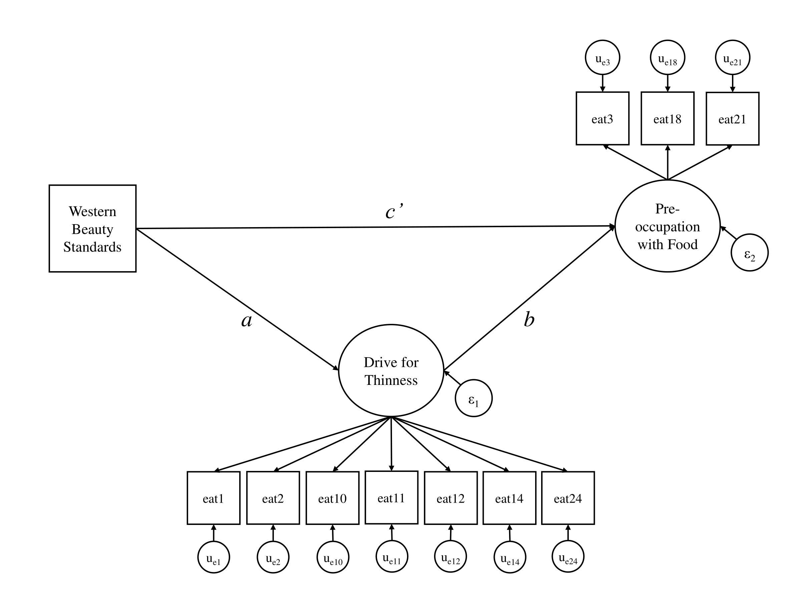

```{r setup, echo = FALSE, message = FALSE, warning = FALSE}
library(knitr)
library(dplyr)
library(magrittr)
library(mice)

set.seed(235711)

source("../../../code/supportFunctions.R")

## Define an asis engine that will evaluate inline code within an asis block:
knit_engines$set(asis = function(options) {
  if(options$echo && options$eval) knit_child(text = options$code)
}
)

opts_chunk$set(include = params$answers, 
               echo = params$answers, 
               eval = params$answers,
               message = FALSE,
               warning = FALSE,
               fig.align = "center",
               comment = NA)

dataDir <- "../../../data/"
figDir <- "figures/"
```

<!-- 
Define some hacky LaTeX commands to force nice spacing between lines    
NOTE: These must be called within a math environment (e.g., $\va$)
-->
\newcommand{\va}{\\[12pt]}
\newcommand{\vb}{\\[6pt]}
\newcommand{\vc}{\\[3pt]}
\newcommand{\vx}[1]{\\[#1pt]}

---

In this lab, you will practice methods for dealing with missing data when using 
[**lavaan**][lavaan] to fit latent variable models.

---

# Data

---

```{r, eval = TRUE, include = FALSE}
dataDir <- "../../../data/"
ea      <- readRDS(paste0(dataDir, "eating_attitudes.rds"))
```

For this lab, we will go back to working with the *Eating Attitudes* data from 
Lab 1. These data are available as [*eating_attitudes.rds*][ea_data1]. 

As before, this dataset includes `r nrow(ea)` observations of the following 
`r ncol(ea)` variables. Note that the variables are listed in the order that 
they appear on the dataset.

- `id`: A numeric ID
- `eat1:eat24`: Seven indicators of a *Drive for Thinness* construct
- `eat3:eat21`: Three indicators of a *Preoccupation with Food* construct
- `bmi`: Body mass index
- `wsb`: A single item assessing *Western Standards of Beauty*
- `anx`: A single item assessing *Anxiety Level*

You can download the original data [here][ea_data0], and you can access the code 
used to process the data [here][ea_code].

---

##

**Read in the *eating_attitudes.rds* dataset.**

```{r, eval = FALSE}
ea <- readRDS(paste0(dataDir, "eating_attitudes.rds"))
```

NOTE: 

1. In the following, I will refer to these data as the *EA data*.
1. Unless otherwise specified, the data analyzed in all following questions are 
the EA data.

---

# Naive Analysis

---

In these lab exercises, you will use the *EA data* to conduct a confirmatory 
factor analysis with the [**lavaan**][lavaan] package. 

Of course, we can estimate models in **lavaan** without doing anything fancy to 
the missing data. If we fit a model to incomplete data using **lavaan**, the 
software will automatically apply listwise deletion to remove any missing 
data before estimating the model.

Although you should almost never use deletion-based treatments, we'll start our 
modeling exercises by fitting a model using the default complete case analysis. 
Sometimes, something goes wrong with the modeling, and you end up deleting cases 
accidentally. If you're keyed into the signs that listwise deletion has occurred, 
you'll know what to check when working with these methods in the wild.

---

## {#cfaSyntax}

**Define the model syntax for the CFA.**

The data only contain multi-item scales for *Drive for Thinness* and 
*Preoccupation with Food*, so we only need a two-dimensional CFA evaluating the 
measurement structure of these two factors.

- Indicated the *Drive for Thinness* factor from the seven relevant scale items.
   - `eat1`, `eat2`, `eat10`, `eat11`, `eat12`, `eat14`, `eat24`
- Indicated the *Preoccupation with Food* factor from the remaining three scale 
items.
   - `eat3`, `eat18`, `eat21`
   
```{r, eval = TRUE}
cfaMod <- '
drive =~ eat1 + eat2  + eat10 + eat11 + eat12 + eat14 + eat24
pre   =~ eat3 + eat18 + eat21
'
```

---

##

**Estimate the CFA model on the EA data.**

- Correlate the latent factors.
- Set the scale by standardizing the latent factors.
- Estimate the mean structure.
- Use complete case analysis to treat the missing data.

```{r}
library(lavaan)
naiveCfa <- cfa(cfaMod, data = ea, std.lv = TRUE, meanstructure = TRUE)
```

---

## 

**Summarize the fitted CFA and check the model fit.**

- Do the parameter estimates look sensible?
- Does the model fit the data well enough?
- How many observations were deleted?

```{r}
summary(naiveCfa)
fitMeasures(naiveCfa)
```

```{asis}
This model looks fine. All measurement model parameters seem reasonable, and the 
model fits the data well. That being said, `r nrow(ea) - lavInspect(naiveCfa, "nobs")` 
observations were deleted to "fix" the missing data. Also, we can be reasonably 
certain that these estimates are biased, unless the data were all missing 
completely at random (MCAR). Even though the estimates look "good", they can 
still be wrong.
```

---

# FMI

---

The fraction of missing information (FMI) is a crucial statistic for quantifying 
the extent to which missing data (and their treatment) affect parameter estimates. 
We generally calculate the FMI for the estimates of our substantive model 
parameters, but we can also use the FMI as a descriptive tool before fitting 
any substantive model.

With FIML, we can easily compute the FMI using the approach described by 
[Savalei and Rhemtulla (2012)][fimlFmi].

##

**Calculate the fraction of missing information for the summary statistics.**

- The FMI for the sufficient statistics (e.g., means, variance, and covariances)
of our data can give us a good idea of what level of FMI to expect for models 
fit to those data.
- With the `fmi()` function from [**semTools**][semTools], we can efficiently 
compute the FMI for sufficient statistics using the FIML-based approach 
described by [Savalei and Rhemtulla (2012)][fimlFmi].

```{r, R.options = list(width = 100)}
library(semTools)

fmi <- ea %>% select(-id) %>% fmi()

fmi$Covariances$fmi

fmi$Means %>% select(variable, fmi) %>% print(digits = 3)
```

---

# Basic FIML

---

##

**Estimate the CFA defined in \@ref(cfaSyntax) using FIML.**

- Fit the model to the incomplete EA data.
- Correlate the latent variables.
- Estimate the mean structure.
- Set the scale by standardizing the latent variables.

```{r}
fimlCfa1 <- cfa(cfaMod, data = ea, std.lv = TRUE, missing = "fiml")
```

```{asis}
To implement basic FIML estimation, we need only add the `missing = "fiml"` 
option to our `cfa()` call.
```

---

##

**Summarize the fitted model.**

- Include the FMI statistics in your summary
   - Do any of these FMI values give you pause?
   $\vb$
- Does the number of missing data patterns shown in the summary match the number 
you calculated in Lab 1?
   - If not, what do you think causes this discrepancy?
- Do the parameter estimates looks sensible?
- Does the model fit the data well enough?

```{r}
summary(fimlCfa1, fmi = TRUE)
fitMeasures(fimlCfa1)
```

```{asis}
- None of the FMI values are especially large.
```

```{r, echo = FALSE, eval = FALSE}
fmi1 <- summary(fimlCfa1, fmi = TRUE)$pe$fmi
fmi2 <- summary(miCfa, fmi = TRUE)$fmi %>% quiet()

dat <- data.frame(FMI = c(fmi1, fmi2), 
                  Method = rep(c("FIML", "MI"), each = length(fmi1))
                  )

ggplot(dat, aes(FMI, color = Method)) + 
  geom_boxplot() +
  theme_classic()
```

```{r, echo = FALSE}
pats <- mice::md.pattern(ea, plot = FALSE)
```

```{asis}
- The number of response patterns listed in the summary,
`r lavInspect(fimlCfa1, "patterns") %>% nrow()`, 
is fewer than the number of patterns calculated from the full dataset, `r nrow(pats) - 1`.

   - This discrepancy arises because we are only analyzing a subset of the 
   incomplete variables here. The total number of response patterns increases 
   when considering the full dataset.
$\va$
- Generally, the model looks good. The parameter estimates all seem sensible, 
and the model fits the data very well.
```

---

# Auxiliary Variables

---

Although the model above seems to have produced satisfactory estimates, the MAR 
assumption will have been violated unless the missingness on the indicators of 
`drive` and `pre` is associated only with other such indicators. If, for example, 
missingness on some of the `pre` items is associated with *BMI*, then the data 
are MNAR, and the model estimates are probably biased.

- We can address this issue by including auxiliary variables (i.e., potential 
correlates of missingness in which we have no substantive interest) via the 
[Graham (2003)][graham_2003] saturated correlates technique.

---

##

**Rerun the CFA using `bmi`, `anx`, and `wsb` as auxiliary variables.**

- Include the auxiliaries via the saturated correlates approach.
- Keep all other model parameterization and estimation settings the same as above.

*HINT*: The **semTools**::`cfa.auxiliary()` function can be very helpful here.

```{r}
fimlCfa2 <- cfa.auxiliary(cfaMod, 
                          data   = ea, 
                          aux    = c("bmi", "anx", "wsb"), 
                          std.lv = TRUE)
```

```{asis}
NOTE: When you run this model, you will probably receive a warning message about 
a not positive definite residual covariance matrix. As you can see from the 
eigenvalues below, it is true that the residual covariance matrix is NPD. 
```

```{r}
## Extract the residual covariance matrix:
theta <- lavInspect(fimlCfa2, "theta")

## Indeed, we have a negative eigenvalue => NPD
eigen(theta)$values
```

```{asis}
However, I honestly cannot figure out what's wrong. As you can see below, the 
residual covariance matrix itself looks fine (i.e., no Heywood cases, no extreme 
values, all covariances are legal according to the relevant triangle inequalities). 
```

```{r, R.options = list(width = 100)}
print(theta)
```

```{asis}
If you want to check my sleuthing w.r.t. this issue, you can find the relevant 
code [here][ea_mwe]. In the end, I'm willing to tentatively trust these estimates.
```

---

##

**Summarize the CFA model and check the model fit.**

- How do the results compare to the model estimated without auxiliary variables?

```{r}
summary(fimlCfa2, fmi = TRUE)
fitMeasures(fimlCfa2)
```

```{asis}
The results are all very similar, and this model looks equally good. The 
similarity of the results should not be too surprising when considering the 
relatively small amount of missing data. One interesting difference is that the 
number of missing data patterns given in the output now matches the number we 
computed for the entire dataset. Of course, this change is also natural since we 
are now using every variable from the EA data in the model.
```

---

# Mediation

---

Here, we'll estimate a medation model wherein *Western beauty standards* predict 
*preoccupation with food*, and *drive for thinness* mediates this relation.

- You can see the path diagram for this model below.

```{r, include = TRUE, eval = TRUE, echo = FALSE}

```

---

## {#medSyntax}

**Define the model syntax for the structural model.**

- Specify all paths needed to test the mediation hypothesis described above.
- Include a defined parameter to quantify the indirect effect.

```{r, eval = TRUE}
## Define only the new structural parts:
semMod3 <- '
pre   ~ b * drive + cp * wsb
drive ~ a * wsb

ab := a * b
'

## Add on the measurement part:
semMod3 <- paste(cfaMod, semMod3, sep = '\n')
```

##

**Use FIML to estimate the mediation model defined in \@ref(medSyntax).**

- Include `bmi` and `anx` as auxiliary variables.
- Use B = 1000 bootstrap resamples to quantify the sampling variability.

*NOTE*: This code will take quite a long time to run. So, if you want to run the 
code yourself, consider first doing so with a small number of bootstrap samples 
(e.g., $B = 50$) to get a sense of the run time to expect.

   - If you want a more accurate estimate, you can time this baby run with 
   `system.time()` and extrapolate from there.

```{r fiml_mediation_boot, cache = TRUE}
## Estimate the mediation model using FIML with auxiliaries and bootstrapping:
fimlSem3 <- sem.auxiliary(semMod3, 
                          data      = ea, 
                          aux       = c("bmi", "anx"),
                          std.lv    = TRUE, 
                          se        = "boot", 
                          bootstrap = 1000)
```

---

##

**Summarize the fitted mediation model and interpret the results.**

- Is the indirect effect through *Drive for Thinness* significant according to 
the 95% BC CI?
- Briefly interpret the indirect effects.

```{r}
summary(fimlSem3, fmi = TRUE)

parameterEstimates(fimlSem3, boot.ci.type = "bca.simple") %>% 
  select(-(1:3)) %>%
  tail(1)
```

```{r, include = FALSE}
out <- parameterEstimates(fimlSem3, boot.ci.type = "bca.simple") %>% tail(1)
```

```{asis}
- Yes, the indirect effect through *Drive for Thinness* is statistically 
significant (
$ab = `r round(out$est, 3)`$, 
$95\%~CI_{BC} = [`r round(out$ci.lower, 3)`; `r round(out$ci.upper, 3)`]$
).
- The results suggest a statistically significant, positive indirect effect by 
which the influence of Western beauty standards on preoccupation with food is 
transmitted through drive for thinness. This effect implies a process whereby 
higher levels of Western beauty standards promote a greater drive for thinness 
which, in turn, contributes to increasing preoccupation with food. 
```

---

End of Lab 6

---

[amda]: https://www.cms.guilford.com/books/Applied-Missing-Data-Analysis/Craig-Enders/9781606236390
[ea_data0]: https://www.appliedmissingdata.com/analyses
[ea_data1]: ../../../data/eating_attitudes.rds
[ea_code]: ../../../code/process_eating_data.R
[fimlFmi]: https://doi.org/10.1080/10705511.2012.687669
[ggmice]: https://amices.org/ggmice/index.html
[lavaan]: https://cran.r-project.org/web/packages/lavaan/
[semTools]: https://cran.r-project.org/web/packages/semTools/index.html
[mice]: https://cran.r-project.org/web/packages/mice/index.html
[graham_2003]: https://doi.org/10.1207/S15328007SEM1001_4
[ea_mwe]: https://github.com/kylelang/lavaan-e-learning/blob/main/code/lab_prep/enders_eating_data_mwe.R